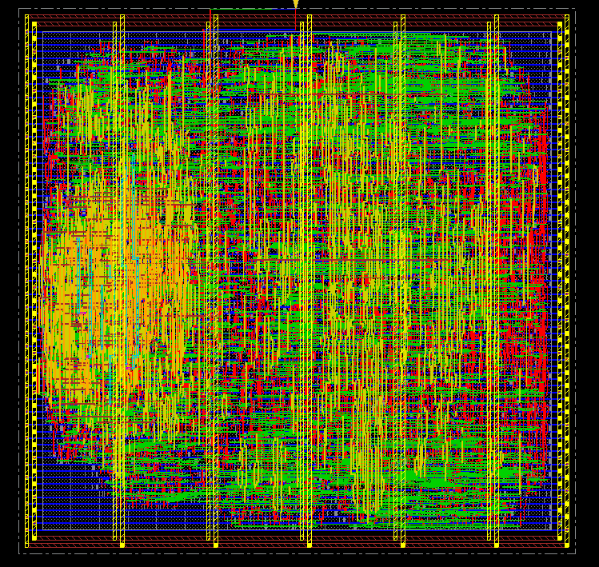

# DLX microprocessor, RTL vhdl design

 
Gai Omar, Dalmasso Luca. Politecnico di Torino

**RTL Description, Sythesis and Physical design of a 32 bit RISC architecture on a simple 4 stages pipeline.**

 
 
# Project folders and organization:
 
RTL bottom-up design: DLX_simulation/  
RTL for synthesis: DLX_synthesizable/  
Physical Design: DLX_physical_design/
 

# Script for synthesis and compile
to be used with Synopsis 
[Synthesis script](synthesis.tcl) 
[QuestaSim compile file](DLX_simulation/compile) 
[Script for pre-synthesis](tool.sh) 
 
 
# Report
Additional information ca be found here:
[Report](report.pdf)
